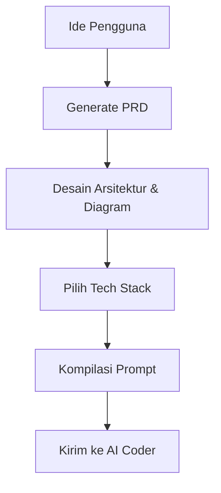

# AI Workflow Studio


*(Tempat untuk memasukkan gambar banner/logo utama)*

**AI Workflow Studio** adalah alat generasi workspace dan aplikasi berbasis AI tingkat lanjut yang dirancang untuk membantu pengguna mendesain ide menjadi Product Requirements Document (PRD), membuat arsitektur atau diagram alur kerja, mendefinisikan tumpukan teknologi, dan secara otomatis menyusun "Vibe Coding Super Prompt" yang sangat komprehensif. Prompt ini kemudian siap digunakan oleh agen AI lainnya untuk mengeksekusi pembuatan kode secara presisi dan efisien.

---

## 🌟 Fitur Utama

AI Workflow Studio hadir dengan berbagai modul canggih untuk mempercepat proses konseptualisasi hingga eksekusi:

### 1. Ideation & PRD Generator
Sistem pintar yang mampu mengubah ide mentah dari input pengguna menjadi **Product Requirements Document (PRD)** yang terstruktur. PRD yang dihasilkan sudah lengkap dengan target audiens, fitur Minimum Viable Product (MVP), serta batasan-batasan teknis yang relevan.

*(Tempat untuk memasukkan gambar screenshot fitur PRD)*

### 2. Diagram & Flowchart Builder
Mendukung pembuatan diagram alur kerja (workflow) secara instan. Representasi visual yang terbuat dari sintaks seperti Mermaid.js ini membantu pengembang maupun agen AI memahami logika navigasi, status aplikasi, dan arsitektur data.

*(Tempat untuk memasukkan gambar screenshot flowchart/diagram)*

### 3. Tech Stack Suggester
Secara otomatis menganalisis kebutuhan dalam PRD dan memberikan rekomendasi tumpukan teknologi (Tech Stack) yang paling optimal (misalnya: Next.js + Tailwind + Supabase, atau TanStack Start + Node.js + PostgreSQL).

### 4. Vibe Coding Prompt Compiler
Ini adalah fitur andalan dari AI Workflow Studio. Fitur ini menyatukan PRD, Diagram, dan Tech Stack menjadi satu **prompt JSON/Markdown raksasa** yang sangat terperinci. Prompt ini dirancang khusus agar tidak akan di-skip oleh agen AI lainnya saat mengeksekusi pembuatan kode aplikasi.

---

## 🏗️ Arsitektur Sistem

Proyek ini dibangun dengan memisahkan frontend dan backend untuk skalabilitas maksimal.

### Frontend
Frontend dibangun menggunakan **TanStack Start**, yang menyediakan routing tipe-aman dengan *TanStack Router* dan integrasi data yang kuat dengan *TanStack Query*.
- **Styling**: Tailwind CSS dan Shadcn UI (berbasis Radix UI) untuk antarmuka yang modern, responsif, dan mudah diakses.
- **State Management**: React Hooks dan Context API.
- **Animasi**: Framer Motion & CSS Animations untuk pengalaman pengguna yang dinamis.

### Backend
Backend menggunakan **Node.js** dengan struktur modular.
- **Arsitektur**: Berbasis layanan (*Controller -> Service -> Repository*).
- **Validasi Data**: Menggunakan Zod untuk keamanan dan konsistensi data.
- **Database**: Skema diatur menggunakan ORM yang ringan, dioptimalkan untuk PostgreSQL.


*(Tempat untuk memasukkan gambar diagram arsitektur teknis)*

---

## 🔄 Workflow & Diagram Alur Kerja

Bagaimana AI Workflow Studio bekerja dari awal hingga akhir? Berikut adalah alur kerjanya:



### Penjelasan Fase:
1. **Fase Inisiasi**: Sistem memandu pengguna melalui antarmuka interaktif untuk merinci ide dasar.
2. **Fase Perencanaan**: AI menyusun kebutuhan teknis dan non-teknis secara terstruktur ke dalam format PRD.
3. **Fase Desain**: Menghasilkan flowchart aplikasi, user journey, dan desain model data yang divisualisasikan.
4. **Fase Eksekusi**: Hasil dari semua fase dikompilasi menjadi prompt akhir yang siap disalin dan ditempel di platform IDE AI (seperti Cursor, Windsurf, atau agen AI lainnya).

Pengguna dapat melakukan iterasi atau modifikasi pada setiap langkah di atas sebelum menghasilkan prompt akhir. Hal ini untuk memastikan akurasi dan kualitas kode yang nantinya akan dihasilkan oleh AI Coder.

---

## 📡 Referensi API & Struktur Prompt

### Struktur JSON Prompt (Vibe Coding Prompt)
Saat mengekspor hasil akhir, AI Workflow Studio akan menghasilkan struktur JSON berikut untuk dikonsumsi langsung oleh agen AI pengembang:

```json
{
  "frontend": "Spesifikasi UI/UX secara detail. Daftar semua halaman, layout, dan komponen Tailwind CSS.",
  "backend": "Desain sistem backend, arsitektur API, rute (endpoint), middleware, dan skema autentikasi.",
  "database": "Skema DDL PostgreSQL, tipe data UUID, constraint, relasi foreign key, dan skema awal.",
  "tasks": "Daftar urutan langkah (checklist) kronologis untuk pengembangan (contoh: Setup -> Database -> Backend -> Frontend)."
}
```

### Endpoint Internal Backend
Beberapa rute API utama yang menggerakkan AI Workflow Studio:
- `POST /api/generate-prd` : Menerima ide dan menghasilkan dokumen PRD.
- `POST /api/generate-diagram` : Menghasilkan representasi teks untuk flowchart/diagram.
- `POST /api/compile-prompt` : Menyusun seluruh konteks menjadi JSON/Markdown prompt akhir.

---

## 🚀 Panduan Instalasi & Setup

### Prasyarat (Prerequisites)
Pastikan Anda telah menginstal utilitas berikut sebelum menjalankan proyek:
- **Node.js** (Versi 18 ke atas)
- **Bun** (sebagai package manager utama, disarankan untuk performa instalasi)
- **PostgreSQL** (jika menggunakan fitur database lokal)

### Langkah-langkah Menjalankan Proyek
1. **Clone repositori ini** ke mesin lokal Anda.
   ```bash
   git clone https://github.com/username/ai-workflow-studio-03.git
   cd ai-workflow-studio-03/workflowai
   ```
2. **Instal dependensi utama** menggunakan Bun di direktori root.
   ```bash
   bun install
   ```
3. **Instal dependensi backend** (jika backend terpisah). Masuk ke folder server dan jalankan install.
   ```bash
   cd server
   bun install
   cd ..
   ```
4. **Jalankan aplikasi (Development Mode)**.
   ```bash
   bun run dev:all
   ```
   *Perintah ini akan menjalankan frontend dan backend secara serentak.*

---

## 📂 Struktur Folder Utama

Repositori ini disusun secara modular untuk memudahkan navigasi pengembangan:

- `/src` : Berisi seluruh kode React frontend, termasuk komponen antarmuka, rute TanStack, hook kustom, dan utilitas frontend.
- `/server` : Berisi kode backend API (berbasis Express, Nitro, atau Hono) yang menangani logika bisnis dan pemrosesan AI.
- `/public` : Tempat penyimpanan berkas aset statis seperti ikon, gambar statis, dan manifest.
- `/docs` : Dokumentasi lengkap mengenai modul, fitur, arsitektur, dan referensi sistem.

---
*Dokumentasi ini otomatis digenerate dan dikompilasi berdasarkan spesifikasi di dalam direktori `docs`.*
