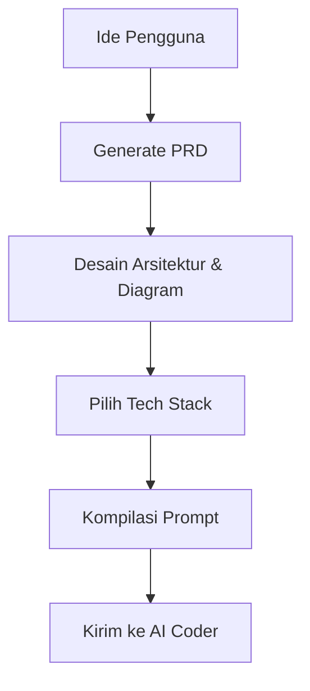

# 4. Workflow & Diagram

## Alur Kerja Standar

## Penjelasan Langkah
1. **Fase Inisiasi**: Sistem memandu pengguna untuk merinci ide.
2. **Fase Perencanaan**: Menyusun kebutuhan teknis dan non-teknis.
3. **Fase Desain**: Menghasilkan flowchart aplikasi dan desain data model.
4. **Fase Eksekusi**: Prompt yang dihasilkan siap di tempel di platform IDE AI.

Pengguna dapat melakukan iterasi di setiap langkah sebelum menghasilkan prompt akhir, memastikan akurasi dan kualitas kode yang akan dihasilkan oleh AI Coder.
